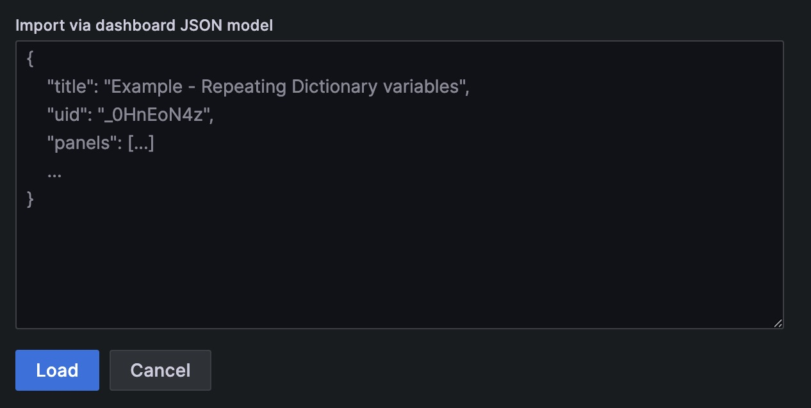
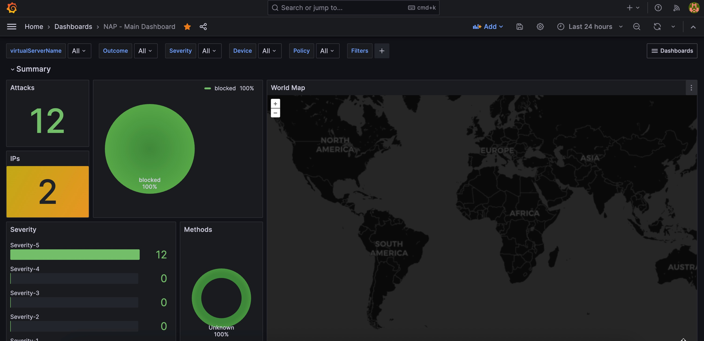
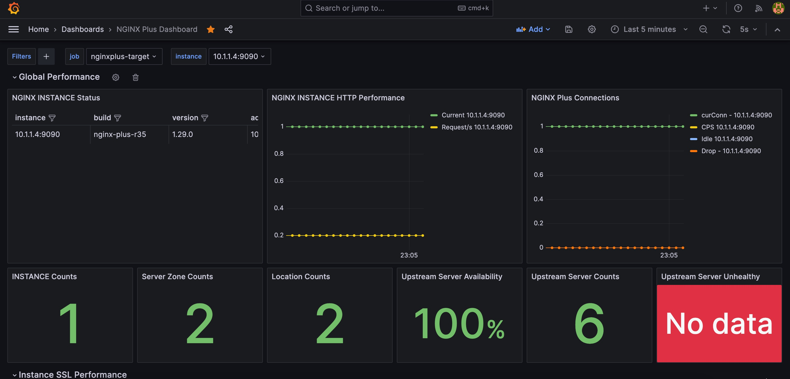
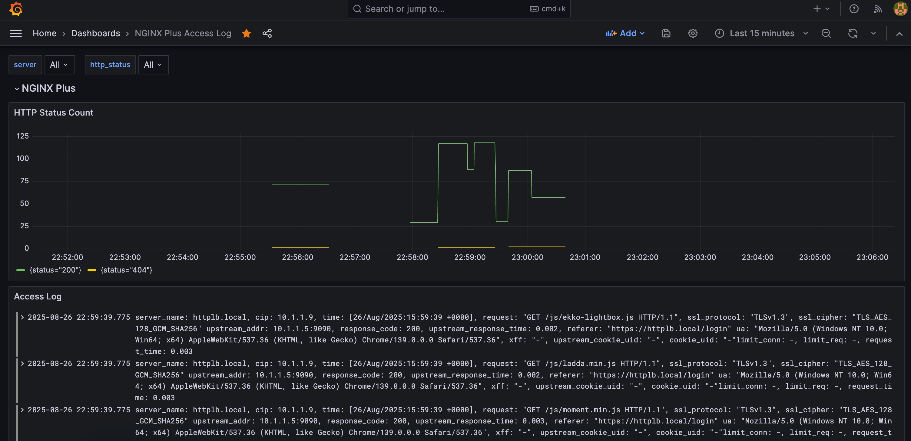

# nginx-plus-dashboard
NAP Security Log, Metric and Access Log Dashboard


## Deployment

To deploy this project run (on Ubuntu 22.04)

```bash
On Grafana Host
1. git clone https://github.com/gto481/nginx-plus-dashboard.git
2. git clone https://github.com/skenderidis/nap-dashboard.git
3. mkdir ~/nap-dashboard/grafana/data
4. mkdir ~/nap-dashboard/grafana/provisioning
5. mkdir ~/nap-dashboard/elastic/data
6. sudo chown -R 472:472 ~/nap-dashboard/grafana/data ~/nap-dashboard/grafana/provisioning
7. cp ~/nginx-plus-dashboard/grafana-host/docker-compose.yaml ~/nap-dashboard
8. cd ~/nap-dashboard
9. docker-compose up -d
10. curl -d "@elastic/index-template-waf.json" -H 'Content-Type: application/json' -X PUT 'http://localhost:9200/_index_template/nginx-nap-logs'
11. curl -d "@grafana/DS-waf-index.json" -H 'Content-Type: application/json' -u 'admin:admin' -X POST 'http://localhost:3000/api/datasources/'
12. curl -d "@grafana/DS-waf-decoded-index.json" -H 'Content-Type: application/json' -u 'admin:admin' -X POST 'http://localhost:3000/api/datasources/'
13. Follow https://github.com/skenderidis/nap-dashboard (Import Dashboard)
14. cd ~/nginx-plus-dashboard/grafana-host
15. curl -d "@loki-datasource.json" -H 'Content-Type: application/json' -u 'admin:admin' -X POST 'http://localhost:3000/api/datasources/'
16. curl -d "@prometheus-datasource.json" -H 'Content-Type: application/json' -u 'admin:admin' -X POST 'http://localhost:3000/api/datasources/'
17. docker run -dit -p 9090:9090 -v ~/prometheus.yml:/etc/prometheus/prometheus.yml --restart=always prom/prometheus
```
```bash
On Grafana dashboard
1. Import ~/nginx-plus-dashboard/grafana-host/grafana_dashboard_json/nginx_plus_metric_dashboard.json
2. Import ~/nginx-plus-dashboard/grafana-host/grafana_dashboard_json/nginx_plus_access_log_dashboard.json
```

### Import Dashboard Menu on Grafana


```bash
On Nginx Host

***Install NGINX Plus with required modules and NAP***

1. cd ~/nginx-plus-dashboard/nginx-host
2. chmod +x nginx_plus_nap_install.sh
3. ./nginx_plus_nap_install.sh
```

```bash
On Nginx Host

***Ensure NGINX Plus and NAP are installed prior the following steps***

1. git clone https://github.com/gto481/nginx-plus-dashboard.git
2. cp ~/nginx-plus-dashboard/nginx-host/nginx/bundles/nap_log_profile.json_dashboard.tgz /etc/app_protect/bundles
3. cp ~/nginx-plus-dashboard/nginx-host/nginx/bundles/policy-demo.tgz /etc/app_protect/bundles
4. sudo chown -R 101:101 /etc/app_protect/bundles
5. cp ~/nginx-plus-dashboard/nginx-host/nginx/nginx.conf /etc/nginx
6. cp ~/nginx-plus-dashboard/nginx-host/nginx/conf.d/default.conf /etc/nginx/conf.d
7. cp ~/nginx-plus-dashboard/nginx-host/nginx/conf.d/httplb.conf /etc/nginx/conf.d
8. cp ~/nginx-plus-dashboard/nginx-host/nginx/conf.d/nginx-plus-mgmt.conf /etc/nginx/conf.d
9. cp ~/nginx-plus-dashboard/nginx-host/nginx/cert/* /etc/nginx/cert
10. cd ~/nginx-plus-dashboard/nginx-host/loki-promtail
11. docker compose up -d
12. sudo systemctl start nginx

```
## Example Dashboard Screenshot
### NGINX App Protect Dashboard



### NGINX Performance Dashboard


### NGINX Access Log Dashboard

